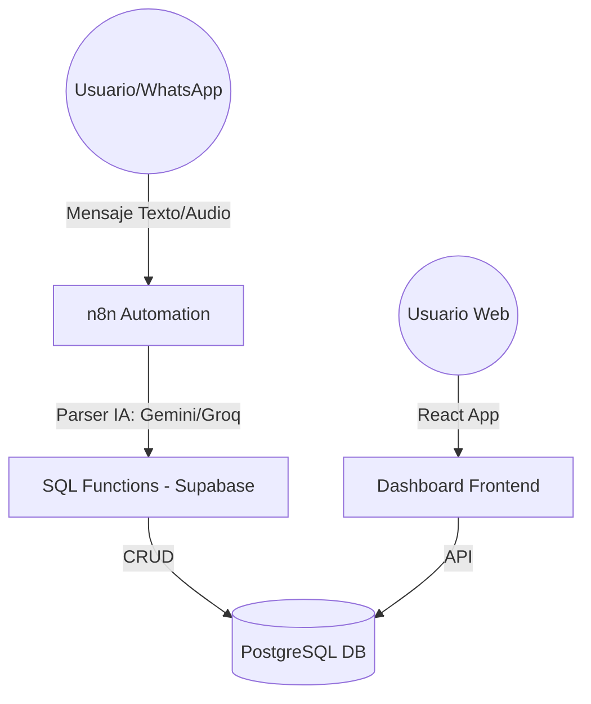

# Sistema de Gestión de Kiosco (Dashboard Ventas)

## Descripción General
Este proyecto es un sistema minimalista y ultra-ligero diseñado para la gestión de ventas, compras, stock y reservas de un kiosco. El ecosistema está compuesto por tres pilares fundamentales: una interfaz web moderna, una base de datos relacional robusta en Supabase y una capa de automatización inteligente mediante n8n.

---

## Arquitectura del Sistema

### 1. Frontend (Dashboard)
Desarrollado con **React**, **Vite** y **Tailwind CSS**, proporciona el centro de control y monitoreo.

> [!IMPORTANT]
> **Dashboard vs Bot:** La creación de registros (Ventas, Compras, Reservas) se gestiona exclusivamente mediante el **Bot de IA**. El Dashboard es una herramienta de **visualización y edición** para corregir errores, ajustar stock y analizar métricas.

- **Vistas Operativas (Modo Edición):**
    - `VentasView`: Monitoreo y ajuste de transacciones de salida.
    - `ComprasView`: Gestión y corrección de abastecimiento.
    - `ReservasView`: Seguimiento y cobro de pedidos pendientes.
    - `ProductosView`: Gestión de catálogo y ajuste manual de stock.
    - `ReportesView`: Análisis de métricas diarias, semanales y mensuales.
    - `AnalisisHorariosView`: Optimización de turnos basada en flujo de ventas.

### 2. Automatización (n8n & IA)
El núcleo de la inteligencia del sistema. Permite procesar lenguaje natural para registrar operaciones sin necesidad de formularios manuales.
- **Flujo Principal:** `Kiosco-n8n V2`
- **Capacidades:**
    - **Procesamiento de Lenguaje Natural:** Utiliza modelos como `Gemini 1.5/2.5` y `Llama 3.3 (Groq)` para interpretar mensajes informales (ej: "vendí 2 cocas y un alfajor jorgito").
    - **Normalización Automática:** Cruza la entrada del usuario con el catálogo oficial de productos para asegurar integridad de datos.
    - **Comandos de Sistema:** Detección de intenciones de cancelación, consulta o corrección de operaciones pasadas.

### 3. Base de Datos (Supabase / PostgreSQL)
La lógica de negocio está delegada en gran medida a funciones SQL para garantizar velocidad y consistencia.
- **Tablas Core:** `ventas`, `compras`, `reservas`, `productos`, `movimientos_dinero`, `movimientos_stock`.
- **Vistas Inteligentes:**
    - `vista_reporte_diario`: Balance de caja en tiempo real.
    - `vista_rentabilidad_productos`: Análisis de costos vs ingresos.
    - `vista_analisis_horario`: Distribución de ventas por franjas horarias.

---

## Características Destacadas

### 🚀 Inteligencia en el Registro
No más formularios tediosos. El sistema permite registrar una venta compleja simplemente escribiendo o hablando.
> "Venta jorge vecino 3 red point comunes y me pago con mercadopago"
El sistema extrae: Cliente (Jorge Vecino), Producto (Cigarrillos Red Point 20u), Cantidad (3), Método de Pago (Mercado Pago).

### 📊 Análisis Predictivo y Operativo
- **Reporte de Rentabilidad:** Calcula automáticamente la ganancia neta restando el costo de mercadería vendida (CMV).

- **Mapa de Calor Horario:** Identifica los momentos de pico para mejorar la atención.

- **Control de Reservas:** Sistema de alarmas para pedidos pendientes de entrega o cobro.

### 🎨 Diseño Premium
- Interfaz minimalista con **Modo Oscuro** nativo.
- Animaciones sutiles y carga de datos ultra-rápida.
- Totalmente responsivo para uso en tablets y móviles.

---

## Guía de Despliegue

### Requisitos
- Node.js & npm
- Cuenta en Supabase
- Instancia de n8n (Local o Cloud)

### Instalación
1. Clonar repositorio.
2. `npm install`
3. Configurar `.env.local` con las credenciales de Supabase.
4. Ejecutar `npm run dev`.

---

© 2026 - Sistema Desarrollado para Kiosco Digital.
